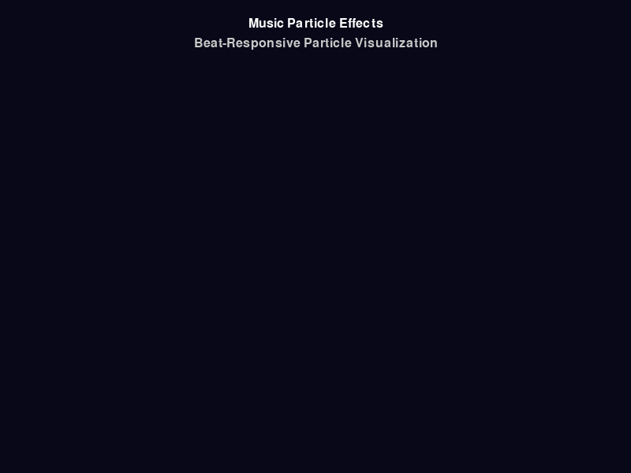

<<<<<<< HEAD
# Python Learning Projects--WangZetian 🐍 

欢迎来到我的 Python 学习项目仓库！这里包含了我在学习 Python 过程中完成的各种项目和练习。(welcome come to my repository)

1:

## 🎵 特色项目

### 音乐粒子特效系统
一个基于音频驱动的实时粒子特效可视化项目，展示了音乐与视觉艺术的结合。(music&art)

**主要特性：**
- 🎵 Real-time audio analysis and beat detection
- 🎨 Particle system
- ⚡ 60FPS Smooth rendering
- 🎮 Interactive control
- 📱 You can press any key on the keyboard to create a beat
  

**PJ location：** `week02/music_particle_effects/`

**quick start：**
```bash
cd week02/music_particle_effects
pip install pygame
python quick_start.py
```
**Main language：** Python 3.8+

**Main repo：**
- `pygame` - Game development and real-time rendering
- `matplotlib` - Data visualization
- `librosa` - Audio analysis
- `numpy` - Numerical analysis
- `requests` - Network requests
- `BeautifulSoup` - Web page parsing
- `FastAPI` - Web API  exploitation
- `Docker` - Containerized deployment

## 🚀 How

1. **clone**
   ```bash
   git clone https://github.com/WangZetian-IVERSON/python_01.git
   cd python_01
   ```

2. **set environment**
   ```bash
   python -m venv .venv
   source .venv/bin/activate  # Linux/Mac
   # 或
   .venv\Scripts\activate  # Windows
   ```

3. **Install dependencies**
   ```bash
   pip install -r requirements.txt
   ```

4. **Run**
   ```bash
   # 例如运行音乐粒子特效
   cd week02/music_particle_effects
   python quick_start.py
   ```

## devote🤝 
Suggestions and improvements are welcome! If you have any ideas or find an issue, please create an issue or submit a pull request.


## 📝licence

Only study。


---
# 2： LM Studio DeepSeek Chatbot


一个功能完善的AI聊天机器人，基于Streamlit构建，支持本地和云端双模式。

## ✨ 特性

- 🤖 **双模式支持**: 自动切换本地LM Studio或DeepSeek云端API （Automatically switch between local LM Studio or DeepSeek cloud APIs）
- 💬 **智能对话**: 支持流式响应和思考过程显示 （Support streaming response and thought process display）
- 📚 **历史管理**: 侧边栏对话历史，支持新建、删除、切换对话 （Sidebar conversation history, which supports creating, deleting, and switching conversations）
- 🎨 **美观界面**: 深色侧边栏+白色文字，主内容区黑色文字 （Dark sidebar + white text, black text in the main content area）
- 🔄 **实时更新**: 流式显示AI回答过程 （Streaming the AI answering process）

## 🚀 快速开始

### 安装依赖
```bash
pip install -r requirements.txt
```

### 启动应用
```bash
streamlit run lmstudio_chatbot.py

*持续学习，不断进步！* 🌟
## 📧 about

- GitHub: [@WangZetian-IVERSON](https://github.com/WangZetian-IVERSON)
- 项目仓库: [python_01](https://github.com/WangZetian-IVERSON/python_01)
=======
# semseg
Semantic Segmentation in Pytorch
>>>>>>> f7b695e (Initial commit)
